# **Cyber Apocalypse 2021**

<p align="center">
  

This is the writeup for the challenges I was able to complete.


***
# Challenge List

* [Reversing](#Reversing)
  - [Authenticator](#Authenticator)
  - [Passphrase](#Passphrase)
  - [Backdoor](#Backdoor)
* [Forensics](#Forensics)
  - [Oldest trick in the book](#Oldest_Trick)
  

***


<p align="center">
  <embed src="CTF-Cyber-Apocalypse-Ferreira-Certificate.pdf" width="800px" height="2100px" />
</p>

# Reversing

## Authenticator

There are two methods I found for this challenge, the easy one(Ghydra), and the hard one(IDA).

The **easy** one (Ghydra):

Open ghydra and analyze the binary.

<p align="center">
  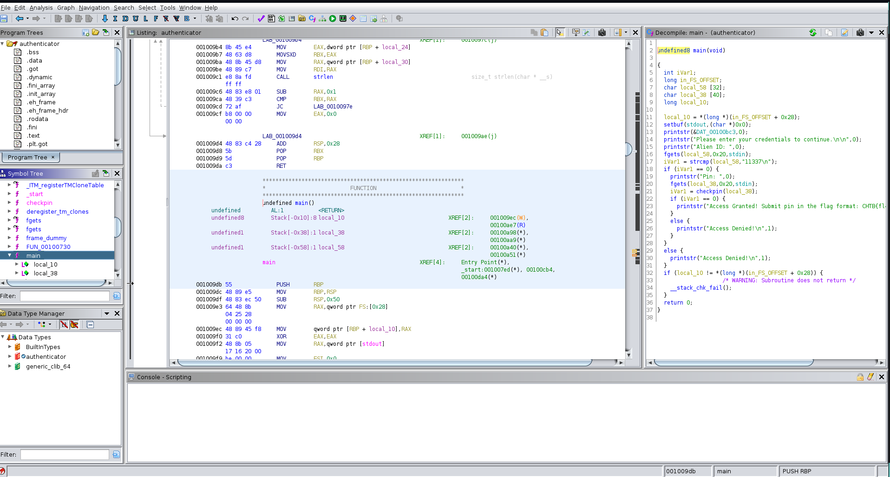

Select the main functon on the left and the C code will show up.

After analyzing the code we can get the ID pretty easily.
ID = 11337

There is also a function named "checkpin" that looks interesting, so lets check that function by double clicking on it.

<p align="center">
  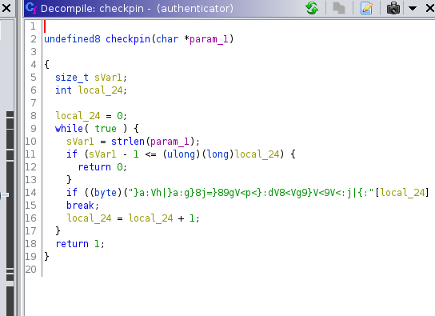

We can write this C program and run it without the length limit to get the flag.

```
#include <stdio.h>
#include <string.h>
int main()
{
  size_t sVar1;
  char str[] = "}a:Vh|}a:g}8j=}89gV<p<}:dV8<Vg9}V<9V<:j|{:";
  
  for(int i = 0; i < strlen(str); i++)
    printf("%c", str[i] ^ 9U);
  return 1;
}
```
Just by running the code I was able to get the flag.

**CHTB{th3_auth3nt1c4t10n_5y5t3m_15_n0t_50_53cur3}**

****
## Passphrase
This one was the easiest

Just by loading the file inside IDA or Ghydra, we could see the password.

Lets try IDA this time.

<p align="center">
  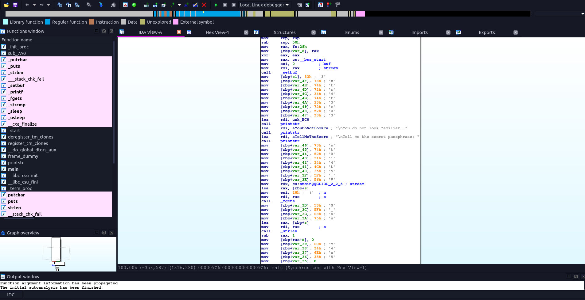

We can already see the password written and we could easily copy it to a text editor.
When we try and submit it on the program we get this message

<p align="center">
  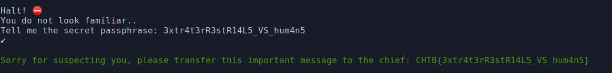

And we get the flag


**CHTB{3xtr4t3rR3stR14L5_VS_hum4n5}**

****
## Backdoor

There was a file to download named "bd", aparently that file was doing nothing.
I tried to run strings on it and found it was actually a python file compiled.

<p align="center">
  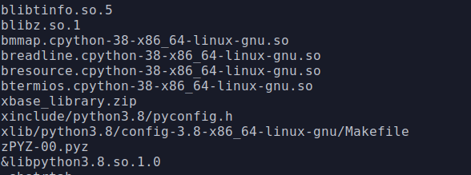

So next step is to figure out how it was compiled.
After some search, I found this stackoverflow which lead me to think that this ELF was created by PyInstaller.

<p align="center">
  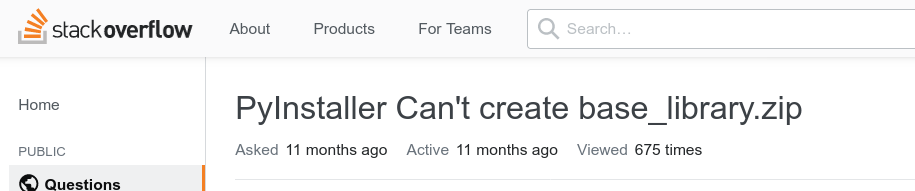

After some more search, found pyinstxtractor. A tool able to extract contents of an executable generated by PyInstaller.

```https://github.com/extremecoders-re/pyinstxtractor/wiki/Extracting-Linux-ELF-binaries```

So I knew how to get the python files used to create this binary.

```
$ objcopy --dump-section pydata=pydata.dump bd

$ python pyinstxtractor.py pydata.dump
```

Which got me a folder.

<p align="center">
  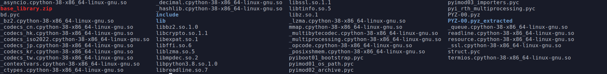

There is one file that highlights from all in my head.
The bd.pyc file. There are many diferent ways to uncompyle it to get the .py file.

So I tried the tool uncompyle6 but it gave me an error.

<p align="center">
  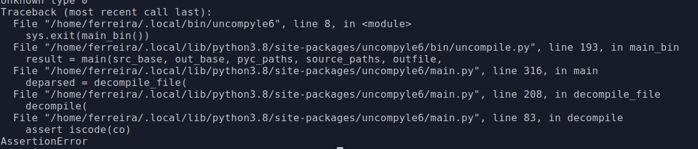

After some time searching about it, I saw something about changing the headers so, I created an executable with PyInstaller to compare.

```
$ pyinstaller example.py
```

<p align="center">
  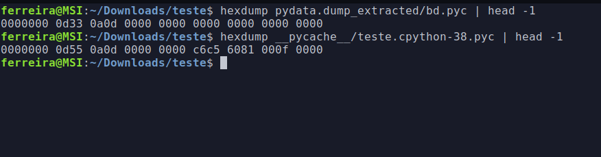

So I used a tool named "hexedit" to edit the header of bd.pyc.

<p align="center">
  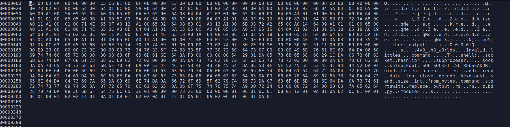

Now when uncompyle6 is executed,we get the bd.py code 

<p align="center">
  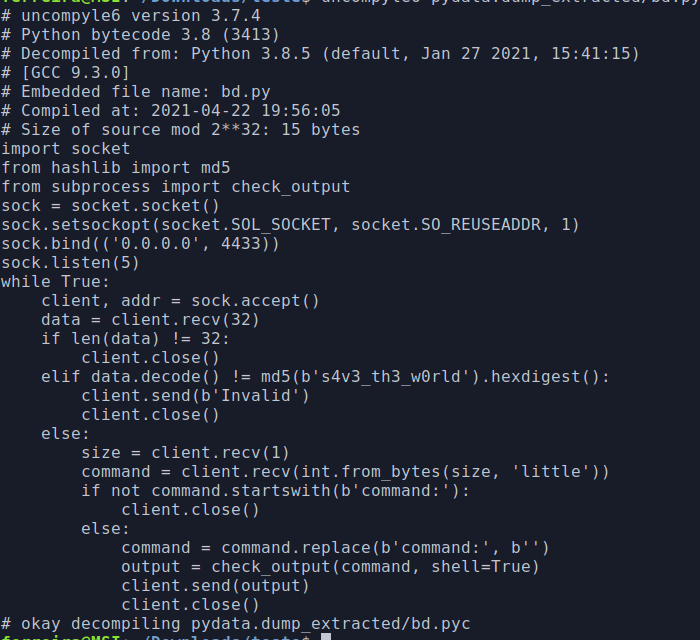

From analyzing this code we can see what we must send to the server to receive output so I wrote a python code that gets the flag.

```

#!/usr/bin/env python3

import socket

HOST = '138.68.181.43'  # The server's hostname or IP address
PORT = 30716        # The port used by the server

with socket.socket(socket.AF_INET, socket.SOCK_STREAM) as s:
    s.connect((HOST, PORT))
    s.sendall(b'e2162a8692df4e158e6fd33d1467dfe0')
    s.sendall(b'1')
    s.sendall(b'command:cat flag.txt')
    data = s.recv(1024)

print(data.decode())

```


**CHTB{b4ckd00r5_4r3_d4nG3r0u5}**

****

# Forensics

## Oldest trick in the book

After analyzing the pcap file using wireshark, it was possible to find many ICMP packets.

<p align="center">
  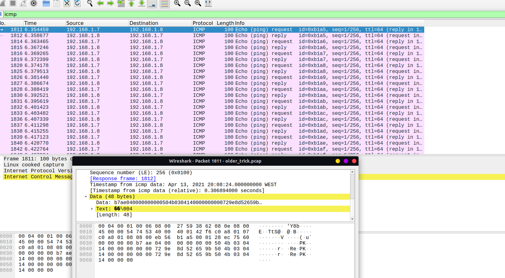


There is data beeing transmited here using .

This is called **ICMP Exfiltration**.

Also we can see the data is repeated so, lets rebuild the file without the repeated bytes.

```
$ tshark -r older_trick.pcap -Y 'icmp.type == 8' -T fields -e data | sed 's/^.\{48\}//' | sed 's/.\{16\}$//' | tr -d '\n' | xxd -r -p - exportFile
```

Lets find out what type of file this is...

```
$ file exportFile
```

<p align="center">
  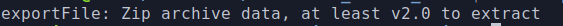

```
$ mv exportFile exportFile.zip
$ unzip exportFile.zip
```

Now I was thinking, "thats it!" but there is still one step to go.

After opening the file I found nothing related with a flag, but instead what seems to be some kind of stored data.

<p align="center">
  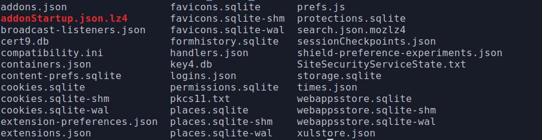

After a quick search I came to a conclusion that those files were files used by firefox profiles.

I created a new firefox profile (just search on the adress bar for about:profiles and firefox profiles will show up)

Then moved both key4.db and logins.json from fini folder to the new created profile folder.

Finally I changed to the created profile and checked the saved passwords.

<p align="center">
  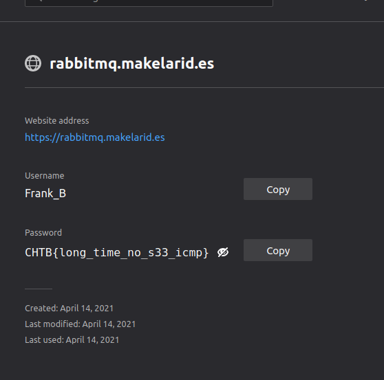

**CHTB{b4ckd00r5_4r3_d4nG3r0u5}**

****

